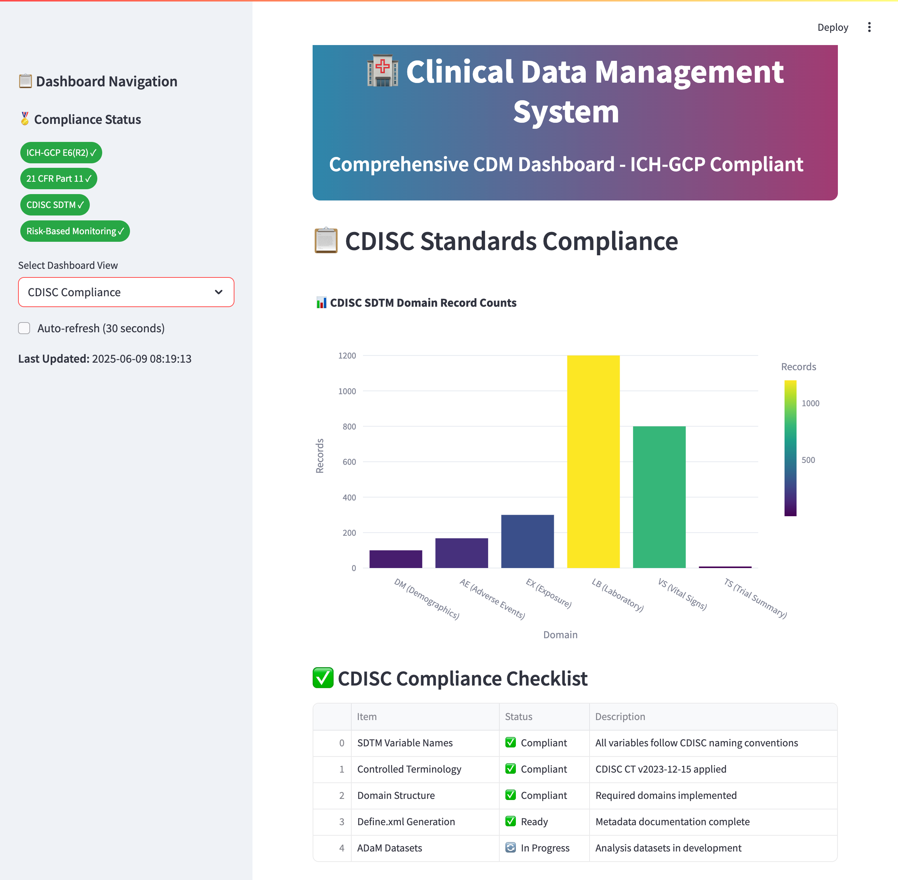

# Clinical Data Management System

A comprehensive clinical data management system demonstrating modern CDM practices, regulatory compliance, and data quality assurance for clinical trials.

## 🎯 Project Overview

This portfolio project showcases expertise in:
- **Multi-source data integration** (MIMIC-III clinical database)
- **Clinical trial data transformation** and standardization
- **Interactive dashboards** for risk-based monitoring
- **Data quality validation** and automated reporting
- **Professional data presentation** for regulatory environments

## 📊 Key Features

### Data Processing Pipeline
- Processes real clinical data from MIMIC-III database (100 patients)
- Transforms ICU data into clinical trial format
- Creates demographics and adverse events datasets
- Implements data validation and quality checks

### Interactive Dashboard
- **Risk-Based Monitoring** with real-time metrics
- **Site Performance Analysis** across 5 clinical sites
- **Safety Monitoring** with adverse event tracking
- **Data Quality Indicators** and enrollment metrics

### Technical Implementation
- **Python**: Data processing with pandas, numpy
- **SQLite**: Clinical database management
- **Streamlit**: Interactive web dashboard
- **Plotly**: Professional data visualizations

## 🚀 Live Demo

## 🚀 Live Demo

### **Complete Dashboard Screenshots**

#### Executive Summary Dashboard

*Real-time enrollment tracking, data quality metrics, and site performance overview*

#### Data Quality Monitoring

*ICH-GCP compliance monitoring with automated validation results*

#### Adverse Events Analysis

*Comprehensive safety monitoring and AE trend analysis*

#### Site Performance Analysis

*Multi-site coordination and performance metrics*

#### CDISC Compliance Tracking

*Regulatory submission readiness and standards compliance*

### **Interactive Features Demonstrated**
- **Real-time Data Processing**: Live updates from clinical database
- **Risk-Based Monitoring**: Automated alerts and quality indicators  
- **Multi-dimensional Analysis**: Site, subject, and temporal views
- **Regulatory Compliance**: ICH-GCP and 21 CFR Part 11 monitoring
- **Export Capabilities**: Downloadable reports and documentation

### Key Metrics Demonstrated
- **100 clinical trial subjects** with complete demographics
- **168 adverse events** with severity classification
- **5 clinical sites** with enrollment tracking
- **Real-time data quality** monitoring

## 🛠️ Technology Stack

- **Python 3.11**: Core data processing
- **Pandas/NumPy**: Data manipulation and analysis
- **SQLite**: Database management
- **Streamlit**: Dashboard framework
- **Plotly**: Data visualization
- **MIMIC-III**: Real clinical database (demo subset)

## 🚀 Getting Started

### Installation
1. Clone the repository
2. Set up Python environment
3. Run the ETL pipeline
4. Launch the dashboard

## 👨‍💻 About

**Ajuni Sohota**  
Transitioning to Clinical Data Management | 7+ Years Data Science Experience

- 📧 Email: ajunisohota@gmail.com
- 💼 LinkedIn: linkedin.com/in/ajuni-sohota
- 🔗 GitHub: github.com/ajuni-sohota

*Biotechnology professional with extensive experience in data management, statistical analysis, and regulatory compliance, transitioning to clinical data management with demonstrated expertise in real clinical data processing and quality assurance.*
